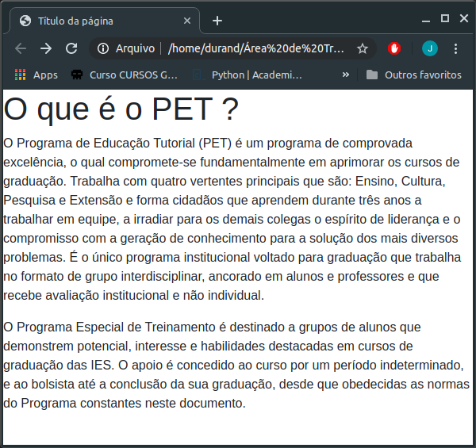

# Exercicio 1

Com as tags já conhecidas fazer uma página como a da imagem, com a estrutura padrão.

## Texto Utilizado

O que é o PET ? 

O Programa de Educação Tutorial (PET) é um programa de comprovada excelência, o qual compromete-se fundamentalmente em aprimorar os cursos de graduação. Trabalha com quatro vertentes principais que são: Ensino, Cultura, Pesquisa e Extensão e forma cidadãos que aprendem durante três anos a trabalhar em equipe, a irradiar para os demais colegas o espírito de liderança e o compromisso com a geração de conhecimento para a solução dos mais diversos problemas. É o único programa institucional voltado para graduação que trabalha no formato de grupo interdisciplinar, ancorado em alunos e professores e que recebe avaliação institucional e não individual. 

O Programa Especial de Treinamento é destinado a grupos de alunos que demonstrem potencial, interesse e habilidades destacadas em cursos de graduação das IES. O apoio é concedido ao curso por um período indeterminado, e ao bolsista até a conclusão da sua graduação, desde que obedecidas as normas do Programa constantes neste documento. 